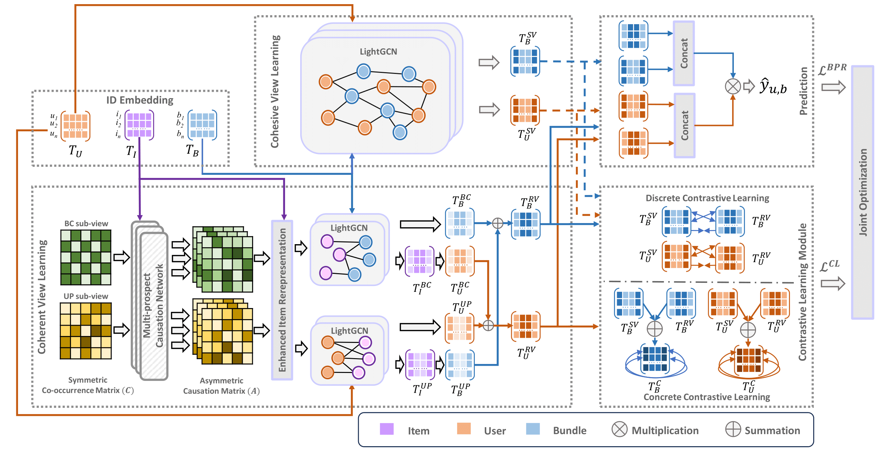

# Bundle Recommendation with Item Causation-enhanced Multi-view Learning
This is the Pytorch implementation for the model **BunCa** of the paper "**Bundle Recommendation with Item Causation-enhanced Multi-view Learning**", published at ECML-PKDD'24.

## Citation

```
@inproceedings{nguyen2024bundle,
  title={Bundle Recommendation with Item-Level Causation-Enhanced Multi-view Learning},
  author={Nguyen, Huy-Son and Bui, Tuan-Nghia and Nguyen, Long-Hai and Hoang, Hung and Thi Nguyen, Cam-Van and Le, Hoang-Quynh and Le, Duc-Trong},
  booktitle={Joint European Conference on Machine Learning and Knowledge Discovery in Databases},
  pages={324--341},
  year={2024},
  organization={Springer}
}
```



## How to run?

- extract 3 datasets (iFashion, NetEase, Youshu) in dataset.tgz
- run `run.sh` to train on 3 datasets Youshu, iFashion, NetEase


## Hyperparams

Some important hyperparameters:
- `lrs`: learning rate
- `sw`: residual connection weight
- `w1/w2`: Cohesive view weight of user/bundle
- `w3/w4`: BC sub-view user/bundle weight


## Dataset

- `bundle_item.txt`: bundle-item affiliation 
- `user_item.txt`: user, item historical interaction
- `user_bundle_train/tune/test.txt`: user-bundle interaction train/valid/test set


## Requirements

- torch == 2.0.1
- scipy == 1.11.2
- torch-geometric == 2.3.1
- tensorboardX == 2.6.2.2
